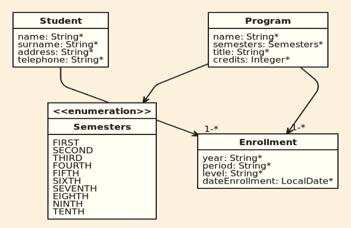

# Proyecto Soap Enrollment Client

Autor: Navarro Arias, Juan Dirceu.  
Modulo: Consumo de APIs.  
Universidad Andina Simón Bolivar.  
Sede Sucre, Bolivia.

## Descripción.

Cliente que consume los servicios _SOAP_ para matricular estudiantes (enrollment) del proyecto [SOAP Enrollment](https://github.com/georgeguitar/soap_enrollment_server.git)

El proyecto está relacionado con el proyecto [REST](https://github.com/georgeguitar/rest_enrollment_server.git)

## Base de datos.
El cliente trabaja sobre la base de datos ser servidor, como se ve en la imagen.  

Tablas:  
- Student.  
- Progrma.  
- Enrollment.  

## Herramientas utilizadas.

Sistema operativo: Debian 10 con Gnome  
IDE: Eclipse v4.12.0  
Navegador web: Firefox 60.8.0esr  
Lenguaje de desarrollo: PHP v7.3  

## Para utilizar el cliente.

Se debe desplegar el cliente en un servidor apache con php.

La URL de acceso al cliente es: [http://uasb-api.rootcode.com.bo/jnavarro/soap_enrollment_client](http://uasb-api.rootcode.com.bo/jnavarro/soap_enrollment_client)

## Servicios para consumir.

Los servicios se puede consumir el cliente se encuentran desplegados en el menú Entities: Student, Enrollment y Program.

- [http://uasb-api.rootcode.com.bo:8078/soapws/students.wsdl](http://uasb-api.rootcode.com.bo:8078/soapws/students.wsdl)  
- [http://uasb-api.rootcode.com.bo:8078/soapws/programs.wsdl](http://uasb-api.rootcode.com.bo:8078/soapws/programs.wsdl)  
- [http://uasb-api.rootcode.com.bo:8078/soapws/enrollment.wsdl](http://uasb-api.rootcode.com.bo:8078/soapws/enrollment.wsdl)  

